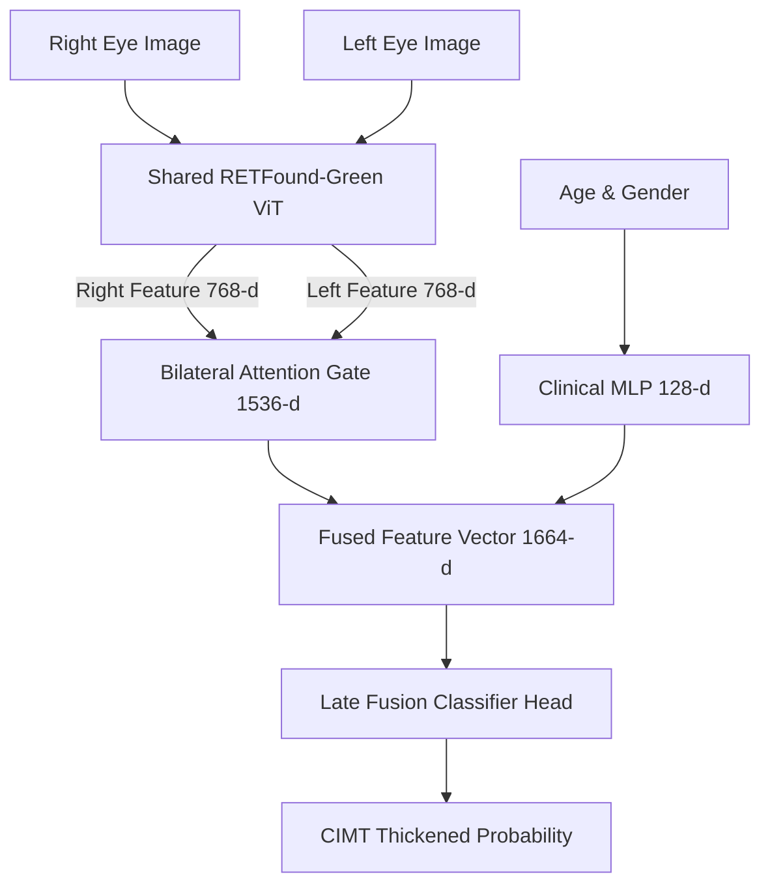

# Multimodal CVD Prediction Pipeline

A production-ready, modular PyTorch implementation of a bilateral multimodal deep learning pipeline for predicting **Carotid Intima-Media Thickness (CIMT)** status (Normal vs. Thickened) as a surrogate biomarker for **Cardiovascular Disease (CVD)**.

---

## 🫀 Why Fundus Images for CVD Prediction?

The human eye offers a rare, non-invasive window into systemic vascular health. The retina is the only part of the body where blood vessels can be directly visualized *without surgery or contrast agents* — making fundus photography a powerful, low-cost screening tool for diseases that are primarily vascular in nature.

**Cardiovascular disease** is driven by the same pathological processes that leave visible signatures in retinal vasculature: arterial stiffness, endothelial dysfunction, hypertensive retinopathy, and microvascular rarefaction. Research has consistently shown that retinal vessel caliber, tortuosity, and arteriovenous ratio correlate strongly with systemic arterial health indicators such as **Carotid Intima-Media Thickness (CIMT)** — a well-validated subclinical marker for atherosclerosis and future cardiovascular events.

Key links between retinal findings and CVD risk include:

| Retinal Biomarker | Cardiovascular Implication |
|---|---|
| Narrowed arteriolar caliber (AVR ↓) | Hypertension, increased arterial stiffness |
| AV nicking / arteriovenous crossing changes | Chronic hypertension, stroke risk |
| Retinal vein occlusion | Atherosclerosis, hypercoagulability |
| Optic disc pallor / cupping | Raised ICP, vascular insufficiency |
| Microaneurysms / exudates | Diabetic macrovascular complications |

This project operationalizes those insights into a deep learning pipeline: **bilateral fundus photographs from both eyes are jointly analyzed** to classify whether a patient's CIMT measurement exceeds the thickening threshold (≥ 0.9 mm), flagging elevated cardiovascular risk — *without a single blood test or ultrasound scan*.

> **Clinical dataset used:** China-Fundus-CIMT (2,903 patients) from Guo et al. 2025, pairing bilateral fundus images with paired CIMT ultrasound measurements and patient demographics (Age, Gender).

---

## 🏗️ Architecture Overview

The pipeline implements a **Siamese network** structure with three main pathways:

1. **Bilateral Image Encoder (Siamese)** — A shared, pre-trained `RETFound-Green` ViT-Base encoder extracts high-dimensional representations (768-d) from the Left and Right eye fundus images.
2. **Bilateral Attention Gate** — Cross-attends left and right eye feature sequences (1536-d concatenated input) to prioritize mutually reinforcing vascular and structural anomalies.
3. **Clinical Projection MLP** — Encodes patient age (normalized) and gender (one-hot) into a clinical feature space (128-d).
4. **Late Fusion Classifier** — Combines the attention-weighted ocular representation (1536-d) and clinical representation (128-d) to predict CIMT thickening via a multi-layer classifier head.



---

## 🧠 RETFound-Green — Pretrained Backbone

This pipeline is built on **RETFound-Green**, a lightweight retinal foundation model based on a **ViT-Small DINOv2** architecture, pretrained on a large-scale corpus of fundus and OCT images using self-supervised learning. It provides rich, generalizable retinal representations that dramatically outperform ImageNet-pretrained backbones on ophthalmic downstream tasks.

### Download Pretrained Weights

Download the `RETFound-Green` checkpoint from the official RETFound GitHub release and place it in the project root (or update `WEIGHTS_PATH` in `config.py`):

| Resource | Link |
|---|---|
| 📄 RETFound Paper (Nature, 2023) | [Zhou et al. 2023 — Nature](https://www.nature.com/articles/s41586-023-06555-x) |
| 🤗 HuggingFace Model Hub | [YifangLi/RETFound_Green](https://huggingface.co/YifangLi/RETFound_Green) |
| 💾 Direct weights download | `RETFound_oct_weights.pth` via HuggingFace files tab |
| 🐙 Official GitHub | [rmaphoh/RETFound_MAE](https://github.com/rmaphoh/RETFound_MAE) |

**Quick download via HuggingFace CLI:**

```bash
pip install huggingface_hub
python -c "
from huggingface_hub import hf_hub_download
hf_hub_download(
    repo_id='YifangLi/RETFound_Green',
    filename='RETFound_oct_weights.pth',
    local_dir='.'
)
"
```

Or directly via `wget`:

```bash
wget -O RETFound_oct_weights.pth \
  "https://huggingface.co/YifangLi/RETFound_Green/resolve/main/RETFound_oct_weights.pth"
```

> **Note:** The weights file is ~330 MB. Once downloaded, set `WEIGHTS_PATH` in `src/configs/config.py` to point to its location.

---

## 📁 Repository Structure

```
cvd_prediction/
├── README.md                   # Project documentation
├── requirements.txt            # Dependency configuration
├── .gitignore                  # Git patterns to ignore
└── src/                        # Source code
    ├── train.py                # Pipeline training orchestrator
    ├── evaluate.py             # Validation calibration, test evaluation, and ablation
    ├── explain.py              # XAI generator (GradCAM++ overlays)
    ├── configs/
    │   └── config.py           # Configuration parameters and paths
    ├── data/
    │   ├── __init__.py
    │   ├── dataset.py          # MultimodalFundusDataset & DataLoader definitions
    │   ├── augmented.py        # Offline dataset balancer
    │   └── augmented/          # Folder for augmented images & metadata
    ├── models/
    │   ├── __init__.py
    │   ├── backbone.py         # RETFound weight parsing and loading
    │   ├── layers.py           # Attention gates & clinical MLP definitions
    │   └── siamese.py          # Multimodal Siamese model wrapper
    ├── engine/
    │   ├── __init__.py
    │   ├── loss.py             # Focal BCE loss with label smoothing
    │   ├── scheduler.py        # Cosine Annealing Warmup scheduler
    │   ├── trainer.py          # Training epoch, Mixup, and progressive unfreezing
    │   └── evaluator.py        # Calibration grid search & ablation helpers
    └── utils/
        ├── __init__.py
        ├── xai.py              # PyTorch-GradCAM++ model wrapper isolators
        └── visualization.py    # Training, Calibration, PR, ROC & CAM grid plotters
```

---

## 🚀 Getting Started

### 1. Prerequisites & Installation

Clone the repository and install the required libraries:

```bash
git clone https://github.com/Austin8547/cvd_prediction.git
cd cvd_prediction
pip install -r requirements.txt
```

### 2. Download Pretrained Weights

Follow the [RETFound-Green download instructions above](#-retfound-green--pretrained-backbone) to obtain `RETFound_oct_weights.pth`.

### 3. Configuration

Decoupled configurations are located in `src/configs/config.py`. Update paths and hardware settings before running:

```python
# src/configs/config.py
JSON_PATH     = '/path/to/data_info.json'
IMAGE_FOLDER  = '/path/to/raw/fundus/images/'
WEIGHTS_PATH  = 'RETFound_oct_weights.pth'
```

### 4. Pipeline Execution

#### A. Model Training

Run the full training pipeline. The script automatically performs offline data augmentation to balance the training set, configures Focal Loss, handles progressive unfreezing schedules, and saves the best checkpoint based on validation AUC:

```bash
python3 src/train.py
```

*Outputs: `best_cimt_green_multimodal_v2.pth` and `training_curves_green_multimodal_v2.png`.*

#### B. Evaluation & Calibration

Evaluate the saved checkpoint. This script runs grid-search temperature scaling on the validation set, applies optimized calibration thresholds, runs Test-Time Augmentation (TTA), and conducts a clinical feature ablation study:

```bash
python3 src/evaluate.py
```

*Outputs: Validation calibration curve (`validation_analysis_green_v2.png`), Test ROC and Confusion Matrix (`evaluation_green_multimodal_v2.png`), and clinical feature ablation chart (`clinical_ablation_green.png`).*

#### C. Explainability (XAI)

Audits the trained network using **GradCAM++**. Individual eyes are isolation-wrapped (freezing the other eye and clinical features as context) to trace visual attention on the target fundus image — verifying that the model focuses on clinically relevant vascular regions:

```bash
python3 src/explain.py
```

*Outputs: `gradcam_single_patient.png` and `gradcam_multi_patients.png`.*

---

## 🛡️ Core Methodological Features

**Offline Class Balancing**
Augments the minority class during preprocessing using medically safe transformations (subtle resizing, horizontal/vertical flips, minor color jittering) to correct training set imbalance before any model sees the data.

**Progressive Backbone Unfreezing**
The ViT encoder is frozen initially, with block slices progressively unfrozen during training (e.g., blocks -8 to -4 at epoch 30, -12 to -8 at epoch 60) to prevent catastrophic forgetting of pretrained retinal representations while adapting to the CIMT task.

**Focal BCE Loss with Label Smoothing**
Addresses residual class imbalance with focal weights that down-weight easy, well-classified samples — paired with label smoothing to prevent overconfident predictions on ambiguous boundary cases.

**Test-Time Augmentation (TTA)**
Prediction robustness is improved by averaging softmax outputs across multiple augmented passes (default: 5) of each test image, reducing sensitivity to input perturbations.

**Temperature Scaling Calibration**
Post-hoc calibration via a learned temperature scalar (T) aligns predicted probabilities with empirical outcome rates, improving the clinical reliability of confidence scores.

---

## 📊 Baseline Performance

The primary benchmark is the **SE-ResNeXt unimodal baseline** from Guo et al. 2025 on the same China-Fundus-CIMT dataset:

| Model | AUC | Accuracy |
|---|---|---|
| SE-ResNeXt (Guo et al. 2025, paper baseline) | 82.58% | 75.0% |
| RETFound-Green Multimodal (this work) | *see training outputs* | *see training outputs* |

---

## 📖 Citation

If you use this codebase, please cite the original RETFound paper and the China-Fundus-CIMT dataset:

```bibtex
@article{zhou2023retfound,
  title={A foundation model for generalizable disease detection from retinal images},
  author={Zhou, Yukun and others},
  journal={Nature},
  year={2023},
  doi={10.1038/s41586-023-06555-x}
}

@article{guo2025cimt,
  title={Carotid intima-media thickness prediction from fundus photographs},
  author={Guo et al.},
  year={2025}
}
```

---

## 🤝 Acknowledgements

Built on top of the [RETFound_MAE](https://github.com/rmaphoh/RETFound_MAE) codebase by Zhou et al. Clinical dataset: China-Fundus-CIMT (Guo et al. 2025).
